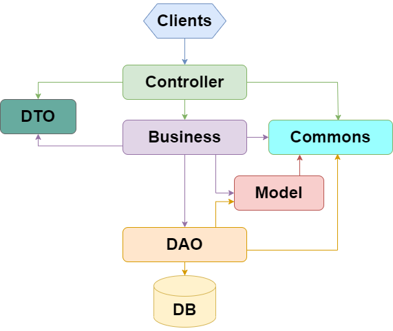

# Project Management System
Приложение управления проектами, задачами внутри проекта, 
командами, которые работают над проектом.

## Описание модулей приложения

### Controller
Модуль интерфейс для веб части, получает и обрабатывает запросы.

### DTO
В модуле data transfer object реализованы классы 
для корректного обмена данными между `controller` и `business`,
а также для ответа `controller`  клиенту.

### Business
Модуль бизнес логики приложения, содержит реализацию сервисов
для каждой сущности и дополнительный функционал.

### Model
В модуле Models будут описаны модели, которые нужны для обмена данными между `business` и `dao`.
Для каждой из сущностей будет написана своя модель.

### DAO
В модуле data access object будут описаны классы для работы с данными в базе данных.

### Commons
Модуль содержит утилитные классы, вспомогательный инструментарий
и перечисления для остальных модулей.

