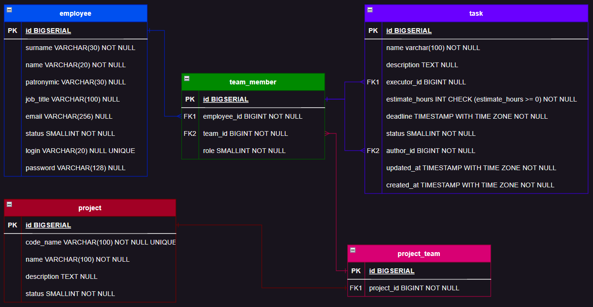

## Физическая ER диаграмма 

1. Таблица **"employee"** - содержит информацию о сотрудниках компании. Атрибуты:
   - id - уникальный идентификатор сотрудника;
   - surname - фамилия сотрудника;
   - name - имя сотрудника;
   - patronymic - отчество сотрудника (может быть пустым);
   - job_title - должность сотрудника (может быть пустым);
   - email - электронная почта сотрудника (может быть пустой);
   - status - статус сотрудника (активен/удалён);
   - login - логин сотрудника для входа в систему (может быть пустым и должен быть уникальным);
   - password - пароль сотрудника для входа в систему (может быть пустым);

2. Таблица **"team_member"** - содержит информацию о принадлежности сотрудников к командам проектов. Атрибуты:
    - id - уникальный идентификатор записи о принадлежности;
    - employee_id - идентификатор сотрудника;
    - team_id - идентификатор команды проекта;
    - role - роль сотрудника в команде проекта;

3. Таблица **"project_team"** - содержит информацию о командах проектов. Атрибуты:
    - id - уникальный идентификатор команды проекта;
    - project_id - идентификатор проекта, к которому относится команда;

4. Таблица **"project"** - содержит информацию о проектах. Атрибуты:
    - id - уникальный идентификатор проекта;
    - code_name - уникальное кодовое название проекта;
    - name - название проекта;
    - description - описание проекта (может быть пустым);
    - status - статус проекта (активен/неактивен);

5. Таблица **"task"** - содержит информацию о задачах проектов. Атрибуты:
    - id - уникальный идентификатор задачи;
    - name - название задачи;
    - description - описание задачи (может быть пустым);
    - executor_id - идентификатор сотрудника, ответственного за выполнение задачи (может быть пустым);
    - estimate_hours - предполагаемое количество часов на выполнение задачи (должно быть неотрицательным);
    - deadline - дата и время окончания выполнения задачи;
    - status - статус задачи (выполнена/не выполнена);
    - author_id - идентификатор сотрудника, создавшего задачу;
    - updated_at - дата и время последнего обновления информации о задаче;
    - created_at - дата и время создания задачи;
